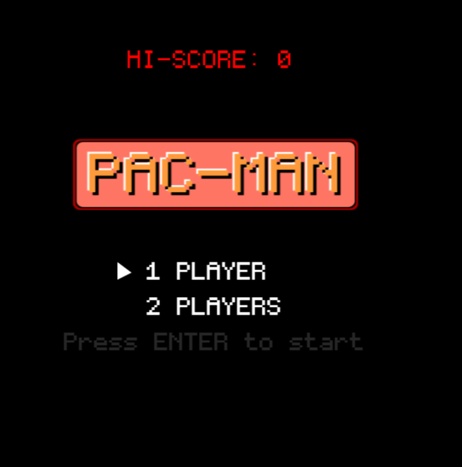
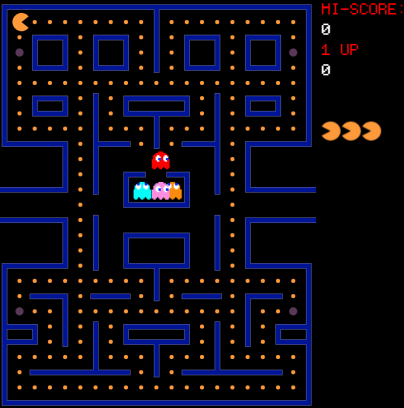

# pacMan

This is PacMan like game.
Like in the old classic PacMan, go through maze, eat pellets and avoid ghosts.

Features implemented:
1. Maze based on spritesheet
2. Animated PacMan
3. Different kind of ghosts and behaviour
- Red - chasing PacMan
- Pink - chasing but trying to be few steps ahead of it
- The rest moves randomly
3. Similar sounds
4. Power ups making ghosts scary

Online version:
[https://projectorsoft.github.io/pacMan](https://projectorsoft.github.io/pacMan/)




## Project Setup

```sh
npm install
```

### Compile and Hot-Reload for Development

```sh
npm run dev
```

### Type-Check, Compile and Minify for Production

```sh
npm run build
```

### Lint with [ESLint](https://eslint.org/)

```sh
npm run lint
```

### Dependencies
npm install --save-dev @babel/types
